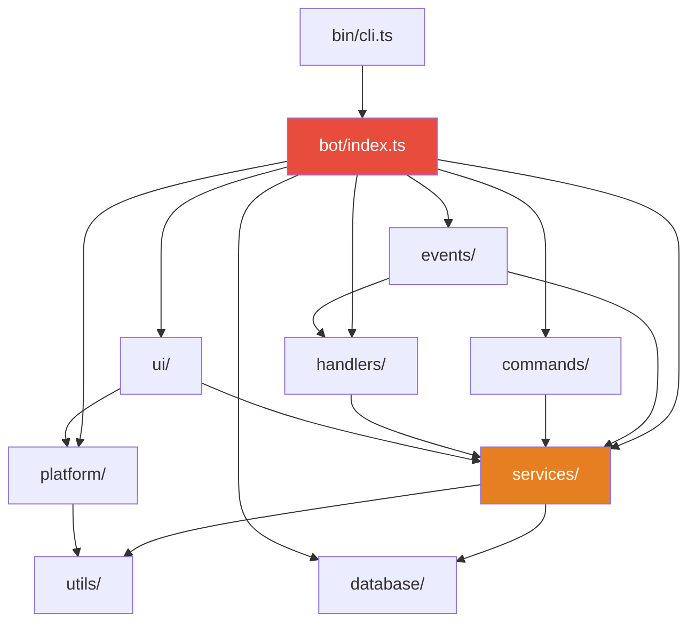

# ClawGravity 全项目架构代码审查

> **审查日期**: 2026-03-10  
> **项目版本**: 0.3.0

## 概述

ClawGravity 是一个基于 Antigravity Agent 的远程控制系统，通过 Discord 和 Telegram 双平台驱动 AI 编码助手。项目使用 TypeScript + Node.js 构建，核心通过 CDP (Chrome DevTools Protocol) 和 gRPC 与本地 Antigravity 实例通信。

| 指标 | 数值 |
|------|------|
| 源文件 | 120 个 `.ts` |
| 总代码行数 | ~27,500 行 |
| 测试文件 | 109 个 |
| 模块目录 | 11 个 (`bin`, `bot`, `commands`, `database`, `events`, `handlers`, `middleware`, `platform`, `services`, `ui`, `utils`) |

---

## 一、架构优势 ✅

### 1. 平台抽象层设计出色

`platform/types.ts` 和 `platform/adapter.ts` 定义了优秀的跨平台抽象：

- `PlatformAdapter` 接口清晰定义了 `start()`, `stop()`, `getChannel()`, `getBotUserId()`
- `PlatformMessage`, `PlatformChannel`, `PlatformButtonInteraction` 等类型完整覆盖消息生命周期
- `PlatformId` / `toPlatformKey()` / `fromPlatformKey()` 提供跨平台实体标识
- `MessagePayload` 统一发送语义，各平台 adapter 负责具体渲染

> 这套抽象非常适合未来扩展新平台（如 Slack、Matrix）。

### 2. 通知构建器纯函数化

`services/notificationSender.ts` 所有导出函数为**纯函数**——无副作用、无 I/O，只返回 `MessagePayload`。这使得：
- 通知逻辑完全可测试
- 平台 adapter 解耦渲染细节
- 代码意图清晰

### 3. Workspace Runtime 职责封装合理

`services/workspaceRuntime.ts` 将单个工作区的 CDP 连接、session 管理、prompt 发送、detector 注册统一封装，形成良好的聚合根 (Aggregate Root) 模式。

### 4. 连接池模式

`services/cdpConnectionPool.ts` 作为 `WorkspaceRuntime` 的注册表和查找层，各 runtime 独立管理生命周期，池化层只负责索引。

### 5. 测试覆盖率高

109 个测试文件覆盖 120 个源文件，测试与源码几乎 1:1。

### 6. 工具链完善

- `jscpd` 检测代码重复（阈值 5%）
- `knip` 检测死代码
- `eslint` + `tsc --noEmit` 类型检查
- 统一的 `npm run check` 执行全链路检查

---

## 二、关键架构问题 🔴

### 问题 1: `bot/index.ts` — 2,696 行的上帝对象 (God Object)

> ⚠️ 这是**最严重的架构问题**。`bot/index.ts` 包含：
> - `startBot()` 主入口（整个启动编排）
> - `sendPromptToAntigravity()` 核心流程（~780 行的单一函数）
> - `restoreDiscordSessionsOnStartup()` 会话恢复
> - `createCoalescedDiscordRenderScheduler()` 渲染调度
> - Discord 和 Telegram 双平台的完整启动与事件绑定

**问题**：
- 所有依赖在 `startBot()` 中现场构造并通过闭包传递，不可测试
- `sendPromptToAntigravity()` 是一个 ~780 行的巨型函数，混合了：流式渲染、截图、图片处理、错误恢复、超时管理、embed 发送
- 60+ 行 import 头部暗示模块边界错位
- Discord 特化逻辑混入平台无关的业务流

**建议**：
1. 提取 `DiscordPromptSession` 类，封装 `sendPromptToAntigravity()` 状态
2. 提取 `BotOrchestrator` 类，管理启动编排和依赖注入
3. 将双平台启动拆分为独立模块

---

### 问题 2: `cdpService.ts` — 1,998 行的超大服务类

`services/cdpService.ts` 承担了过多职责：

| 职责 | 方法/功能 |
|------|-----------|
| WebSocket 连接管理 | `connect()`, `disconnect()`, `call()`, `callWithRetry()` |
| CDP target 发现 | `discoverTarget()`, `probeWorkbenchPages()` |
| Prompt 注入 | `injectPrompt()`, `injectPromptViaGrpc()` |
| 工作区管理 | `discoverAndConnectForWorkspace()`, `launchAndConnectWorkspace()` |
| UI 读取/同步 | `extractResponse()`, `syncUiMode()`, `setUiModel()` |
| gRPC 客户端管理 | `getGrpcClient()`, `ensureGrpcClient()` |
| 进程启动 | `runCommand()` |

**建议**：按关注点拆分为 `CdpConnection`、`WorkspaceDiscovery`、`PromptInjector`、`UiSyncService`。

---

### 问题 3: Telegram 侧架构不对称

虽然已有 `PlatformAdapter` 接口抽象，但实际平台逻辑仍存在显著不对称：

| 模块 | Discord | Telegram |
|------|---------|----------|
| 主流程 | `bot/index.ts` 内联 | `telegramMessageHandler.ts` (1,348 行) |
| 命令处理 | `commands/` 目录 7 个文件 | `telegramCommands.ts` (889 行) 单文件 |
| 事件处理 | `events/` 2 个处理器 | 由 `telegramMessageHandler` 内联 |
| Join 逻辑 | `joinCommandHandler.ts` | `telegramJoinCommand.ts` |

**问题**：Telegram 命令全部集中在一个 889 行文件中，未像 Discord 那样按命令拆分。

---

### 问题 4: 依赖注入不一致

项目混用了多种依赖传递模式：
- **闭包捕获**：`startBot()` 中构造依赖，通过闭包传给内部函数
- **Deps 接口**：`TelegramMessageHandlerDeps`, `InteractionCreateHandlerDeps`, `MessageCreateHandlerDeps` — 手动依赖聚合
- **构造器注入**：`WorkspaceRuntime`, `AgentRouter`, `GrpcResponseMonitor`

> ⚠️ `Deps` 接口越来越庞大（`InteractionCreateHandlerDeps` 有 20+ 字段），实质是将 God Object 的复杂度转移到了类型层面。建议引入统一的服务容器或至少使用 Builder 模式收敛依赖构造。

---

### 问题 5: `CdpConnectionPool` 的 Detector 注册模式重复

`CdpConnectionPool` 中有 5 组完全相同模式的 register/get 方法：

```typescript
registerApprovalDetector(projectName, detector)
getApprovalDetector(projectName)
registerErrorPopupDetector(projectName, detector)
getErrorPopupDetector(projectName)
registerPlanningDetector(projectName, detector)
getPlanningDetector(projectName)
registerRunCommandDetector(projectName, detector)
getRunCommandDetector(projectName)
registerUserMessageDetector(projectName, detector)
getUserMessageDetector(projectName)
```

可以用泛型注册表 `registerDetector<T>(type, projectName, detector)` 替换，减少约 50 行样板代码。

---

## 三、中等优先级问题 🟡

### 问题 6: 渲染格式转换链过长

从 Antigravity 响应到最终平台展示，经过多层转换：

```
Trajectory JSON → AntigravityTrajectoryRenderer (CDP evaluate) → HTML
  → htmlToDiscordMarkdown.ts (Discord)
  → htmlToTelegramHtml.ts (Telegram)
  → plainTextFormatter.ts (fallback)
```

`AntigravityTrajectoryRenderer` (762 行) 在 CDP 上下文中执行复杂的 JS 表达式来解析 UI 结构，这是一种脆弱的逆向工程方式，依赖 `window.__agRendererHelpers` 等内部 API。

### 问题 7: 事件监听器生命周期管理

`GrpcResponseMonitor` 和 `TrajectoryStreamRouter` 都手动管理事件监听器绑定/解绑：

```typescript
// 典型模式 — 每个类都在重复
initStream() { /* 绑定 data/complete/error */ }
teardownStream() { /* 解绑 */ }
removeStreamListeners() { /* 清理引用 */ }
```

建议提取 `StreamLifecycle` 基类或 mixin。

### 问题 8: 配置加载层过多

配置来源有 4 层优先级：`env vars > ~/.claw-gravity/config.json > .env > defaults`。`utils/configLoader.ts` 实现合理，但 `PersistedConfig` 与 `AppConfig` 之间的字段映射有微妙差异（如 `extractionMode` 的 `'legacy' | 'structured'` vs `ExtractionMode` 类型），需要仔细维护。

### 问题 9: 部分中间件层过薄

`middleware/auth.ts` 仅 176 字节，`middleware/sanitize.ts` 仅 556 字节。如此薄的中间件层建议合并到 `utils/` 或直接内联。

---

## 四、代码质量观察 🔵

### 文件规模分布

| 规模 | 文件数 | 占比 |
|------|--------|------|
| > 1,000 行 | 3 | 2.5% |
| 500–1,000 行 | 7 | 5.8% |
| 200–500 行 | ~15 | 12.5% |
| < 200 行 | ~95 | 79.2% |

头部 10 个文件 (8%) 占据约 45% 的总代码量 (~12,300 / 27,500 行)。

### 模块间依赖方向



> ⚠️ `bot/index.ts` 直接依赖几乎所有模块，形成依赖星形拓扑。应通过引入编排层 (orchestrator) 降低扇出。

### 积极方面

- 纯函数 helpers（`notificationSender.ts`, `discordFormatter.ts`, `plainTextFormatter.ts`）很好
- `richContentBuilder.ts` 平台无关的内容构建器设计清晰
- `actionPrefixes.ts` 将 magic strings 集中管理
- 数据库 repository 层模式统一完整（7 个 repository）

---

## 五、优先级排序建议

| 优先级 | 改进项 | 预期收益 |
|--------|--------|----------|
| **P0** | 拆分 `bot/index.ts`（提取 `PromptSession` + `BotOrchestrator`） | 可测试性、可维护性大幅提升 |
| **P0** | 拆分 `cdpService.ts` 按职责拆为 3-4 个模块 | 降低认知负荷，独立演进 |
| **P1** | 统一 Telegram 命令结构（参照 Discord `commands/` 模式） | 双平台对称，降低维护成本 |
| **P1** | 收敛依赖注入模式（统一 Deps 或引入轻量 DI） | 减少 wiring 代码，简化测试 mock |
| **P2** | `CdpConnectionPool` detector 注册泛型化 | 消除样板代码 |
| **P2** | 提取 `StreamLifecycle` 共享流管理逻辑 | 减少重复，防止泄漏 |
| **P3** | 精简 middleware 层（合并/内联） | 简化目录结构 |

---

## 六、总结

ClawGravity 在**平台抽象设计**和**通知构建器纯函数化**方面表现出色，展现了成熟的架构思维。项目工具链完善、测试覆盖充分。

核心改进方向集中在**控制反转不充分**——`bot/index.ts` 和 `cdpService.ts` 两个超大模块承载了过多职责。拆分这两个文件将是提升项目长期可维护性的最有效手段。双平台架构虽有良好抽象基础，但 Telegram 侧的实现尚未完全对齐 Discord 的模块化程度。
